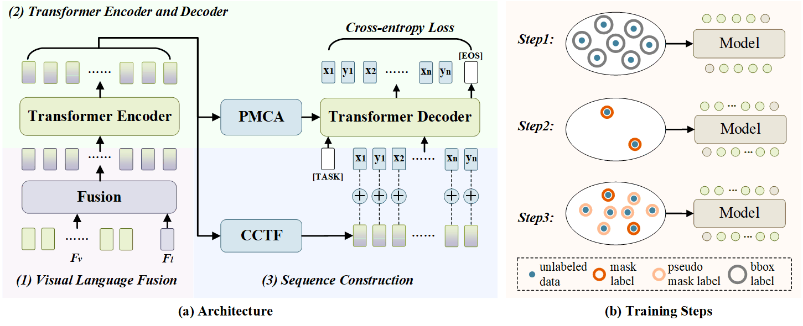

# Partial-RES

  

This GitHub repository contains the code implementation for [Learning to Segment Every Referring Object Point by Point](https://openaccess.thecvf.com/content/CVPR2023/papers/Qu_Learning_To_Segment_Every_Referring_Object_Point_by_Point_CVPR_2023_paper.pdf?ref=https://githubhelp.com). The paper introduces a partially supervised training paradigm for Referring Expression Segmentation (RES), aiming to reduce the requirement for extensive pixel-level annotations. The proposed approach utilizes abundant referring bounding boxes and a limited number of pixel-level referring masks (e.g., 1%) to train the model.

## 🔨Installation

### Prerequisites

```
pip install -r requirements.txt
wget https://github.com/explosion/spacy-models/releases/download/en_vectors_web_lg-2.1.0/en_vectors_web_lg-2.1.0.tar.gz -O en_vectors_web_lg-2.1.0.tar.gz
pip install en_vectors_web_lg-2.1.0.tar.gz
```
Then install SeqTR package in editable mode:
```
pip install -e .
```

## 📁Data Preparation

1. Download [DarkNet-53 model weights](https://drive.google.com/drive/folders/1W8y_WS-8cnuU0LnF8e1v8ZowZvpEaolk?usp=sharing) trained on MS-COCO object detection task.
2. Download the train2014 images from [Joseph Redmon's mscoco mirror](https://pjreddie.com/projects/coco-mirror/).
3. Download our [randomly sampled data](https://drive.google.com/file/d/1sTvNILGzKZhysuNka6y28P6YDeyZlmWH/view?usp=drive_link) with 1%, 5%, and 10% mask annotation.
4. Download the trained REC model weights in [SeqTR](https://github.com/sean-zhuh/SeqTR) including [RefCOCO_REC](https://pan.baidu.com/s/1m70hE43XTqpUPaZ8rbPSDg?pwd=hh3q), [RefCOCO+_REC](https://pan.baidu.com/s/10IXsNKDbsZ_zba8tQZPgkg?pwd=1vw8), [RefCOCOg_REC](https://pan.baidu.com/s/1fObNiIxgWrBy31AkXj9krg?pwd=b6ji).

The project structure should look like the following:

```
| -- Partial-RES
     | -- data
        | -- annotations
            | -- refcoco-unc
                | -- instances.json
                | -- instances_sample_1.json
                | -- instances_sample_5.json
                | -- instances_sample_10.json
                | -- ix_to_token.pkl
                | -- token_to_ix.pkl
                | -- word_emb.npz
            | -- refcocoplus-unc
            | -- refcocog-umd
        | -- weights
            | -- darknet.weights
            | -- yolov3.weights
        | -- images
            | -- mscoco
                | -- train2014
                    | -- COCO_train2014_000000000072.jpg
                    | -- ...
     | -- checkpoint
        | -- refcoco-unc
            | -- det_best.pth
        | -- refcocoplus-unc
            | -- det_best.pth
        | -- refcocog-umd
            | -- det_best.pth
     | -- configs
     | -- seqtr
     | -- tools
     | -- teaser
```
<!-- Note that the darknet.weights excludes val/test images of RefCOCO/+/g datasets while yolov3.weights does not. -->

## 🚅Training

### *Step1: REC Training*

In practice, we load the REC model trained in [SeqTR](https://github.com/sean-zhuh/SeqTR) as a pretrained one. The parameters of the REC model on the three datasets are placed in **. /checkpoint** folder, see **Data Preparation-4** for the download link.

### *Step2: Initial RES Training*

In this step, we train the model with only 1%, 5%, and 10% labeled mask data on
the RES task.

```
python tools/train.py \
configs/seqtr/segmentation/seqtr_segm_[DATASET_NAME].py \
--cfg-options \
ema=True \
data.samples_per_gpu=128 \
data.train.annsfile='./data/annotations/[DATASET_NAME]/instances_sample_5.json' \
scheduler_config.max_epoch=90 \
--finetune-from checkpoint/[DATASET_NAME]/det_best.pth
```

if you need multiple GPUs to train the model, run this:
```
python -m torch.distributed.run \
--nproc_per_node=2 \
--use_env tools/train.py \
configs/seqtr/segmentation/seqtr_segm_[DATASET_NAME].py \
--launche pytorch \
--cfg-options \
ema=True \
data.samples_per_gpu=64 \
data.train.annsfile='./data/annotations/[DATASET_NAME]/instances_sample_5_bbox_pick.json' \
scheduler_config.max_epoch=90 \
--finetune-from checkpoint/[DATASET_NAME]/det_best.pth
```
<!-- Note: 
Instead of sampling 18 points and does not shuffle the sequence for RefCOCO dataset, for RefCOCO+ and RefCOCOg, we uniformly sample 12 points on the mask contour and randomly shffle the sequence with 20% percentage. Therefore, to execute the training on RefCOCO+/g datasets, modify **num_ray at line 1 to 12** and **model.head.shuffle_fraction to 0.2 at line 35**, in configs/seqtr/segmentation/seqtr_mask_darknet.py. -->

### *Step3: Retraining with Pseudo Points*

1. Generate initial pseudo points with the trained RES model in *Step2*. 
```
python tools/test.py \
configs/seqtr/segmentation/seqtr_segm_[DATASET_NAME].py \
--load-from \
work_dir/[CHECKPOINT_DIR]/segm_best.pth \
--cfg-options \
ema=True \
data.samples_per_gpu=128 \
data.val.which_set='train'
```

2. Select pseudo points with RPP strategy. --ratio is the sampling ratio, which is in [1, 5, 10]. 
```
python choose_pseudo_data.py --ratio 5 --dataset refcocog-umd
```
With this script you can generate *instances_sample_5_box_pick.json* in *./data/annotations/refcocog-umd/* folder.

3. Retraining with Selected Pseudo Points
```
python tools/train.py \
configs/seqtr/segmentation/seqtr_segm_[DATASET_NAME].py \
--cfg-options \
ema=True \
data.samples_per_gpu=128 \
data.train.annsfile='./data/annotations/[DATASET_NAME]/instances_sample_5_box_pick.json' \
scheduler_config.max_epoch=90 \
--finetune-from checkpoint/[DATASET_NAME]/det_best.pth
```

## 👓Evaluation

```
python tools/test.py \
configs/seqtr/segmentation/seqtr_segm_[DATASET_NAME].py \
--load-from \
work_dir/[CHECKPOINT_DIR]/segm_best.pth \
--cfg-options \
ema=True \
data.samples_per_gpu=128
```


## 📖Citation
If it's helpful to you, please cite as follows:
```
@inproceedings{qu2023learning,
  title={Learning to Segment Every Referring Object Point by Point},
  author={Qu, Mengxue and Wu, Yu and Wei, Yunchao and Liu, Wu and Liang, Xiaodan and Zhao, Yao},
  booktitle={Proceedings of the IEEE/CVF Conference on Computer Vision and Pattern Recognition},
  pages={3021--3030},
  year={2023}
}
```

## 🏡Acknowledgement

Our code is built on the [SeqTR](https://github.com/sean-zhuh/SeqTR), [mmcv](https://github.com/open-mmlab/mmcv), [mmdetection](https://github.com/open-mmlab/mmdetection) and [detectron2](https://github.com/facebookresearch/detectron2) libraries. 
